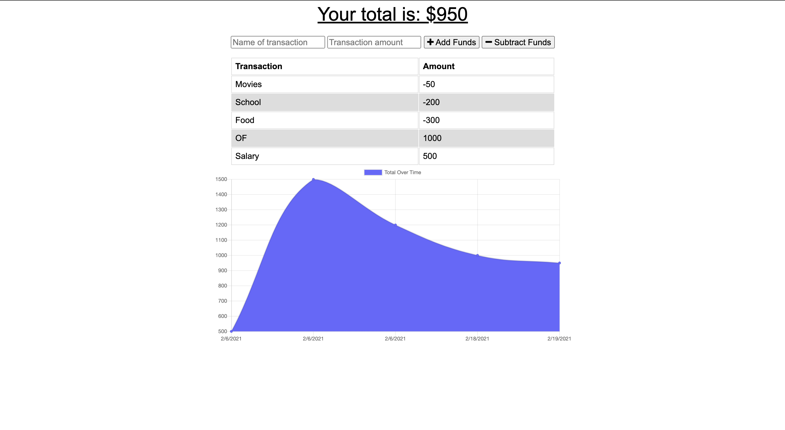

# Budget Tracker

  ## Table of Contents
  1. [Description](#description "Description")
  2. [Installation](#installation "Installation")
  3. [Usage](#usage "Usage")
  4. [License](#license "License")
  5. [Contribution](#contribution "Contributing")
  6. [Tests](#tests "Tests")
  7. [Questions](#questions "Questions")

  ## Description
  

  A PWA that allows to keep track of the user income/expenses. This app works either online or offline, and it can be downloaded on the user's device.

  

  ## Installation
  NA

  ## Usage
  This application is used online, from the Heroku platform. But it can also be downloaded into the user's device.

  ## License
  For more information on the license for this project, please click on the following link:
  [License](https://opensource.org/licenses/Apache-2.0)

  ## Contribution
  This project was a hoemwork for the UM Coding Bootcamp. The initial code was provided. The functionality to make it a PWA was added by Luis Rujana

  ## Tests
  NA

  ## Questions
  If you have any questions regarding this application, please contact me at:  
  [GitHub Page](https://github.com/lmrujana)  
  Email: lmrujanass@gmail.com
